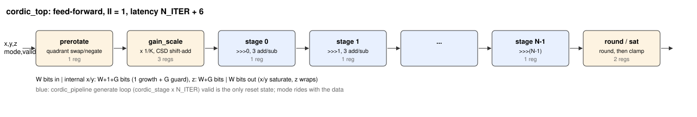
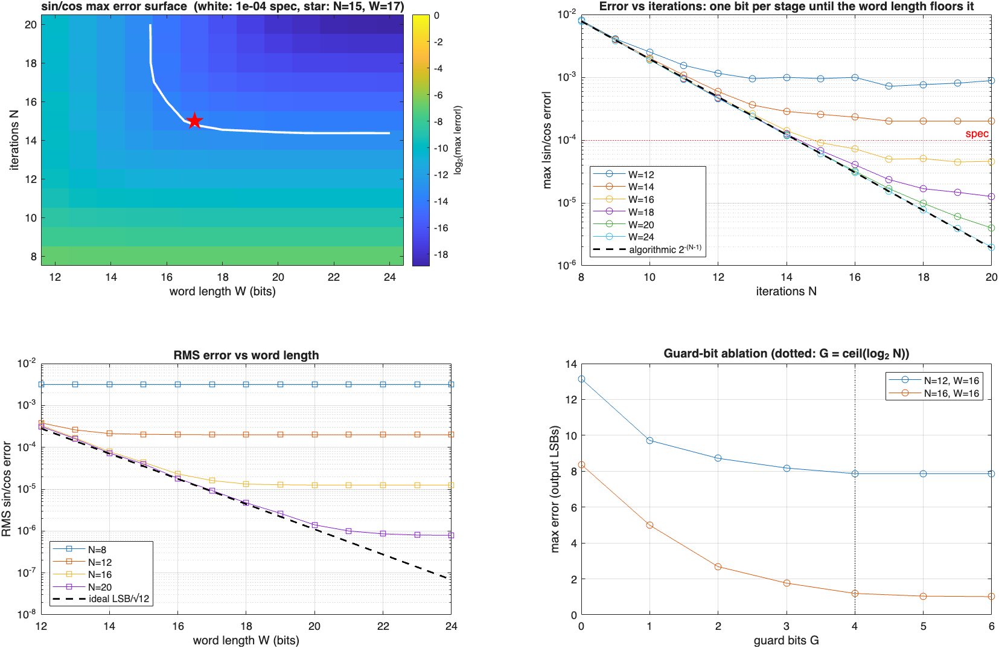

# Pipelined CORDIC Engine

A multiplier-free, fully pipelined CORDIC in SystemVerilog: rotation mode (sin, cos, general vector rotation) and vectoring mode (magnitude, arctan) selected per sample, full ±π input range through a quadrant pre-rotation, gain compensated by a canonical-signed-digit shift-add scaler, and outputs that saturate rather than wrap. The iteration count and word length were not guessed: a MATLAB quantization study over 169 (N, W) configurations picked them, the same MATLAB fixed-point model exports golden vectors, and the RTL matches it **bit for bit** — then the iteration count is swept through Vivado place-and-route to put measured area and Fmax next to the accuracy each configuration buys.

**Headline results**

- **Bit-exact**: 15 610 golden vectors × 5 configurations match the MATLAB fixed-point model on every output bit, including ~1200 saturating vectors per configuration; a second, MATLAB-independent directed bench passes 46/46
- **Multiplier-free, measured**: 0 DSP48s post-route in every configuration, including the 1/K gain compensation
- **Operating point chosen by data**: N = 15, W = 17 is the cheapest of 169 modelled configurations meeting a 1e-4 worst-case error spec on sin, cos, magnitude and phase (13.6 effective bits)
- **Setup-limited Fmax of 274 MHz** for the operating point on a −1 Zynq-7020, derived from post-route slack at a 3.000 ns constraint, in 1432 Slice LUTs / 1430 FFs (4.000 ns run) — one result per clock. At a 4.000 ns constraint setup is met (+0.092 ns, 0 failing endpoints) but **hold is not** (24 failing endpoints, −0.141 ns worst slack), so overall constraints are **not met** in this out-of-context flow — see the synthesis section
- **The sweep shows where iterations stop paying**: 8 → 16 iterations buys 7.3 bits of accuracy for +55 % Slice LUTs; 16 → 20 buys one more bit for another +21 %, because at W = 17 the word length, not N, has become the limit

---

## What problem this solves

sin, cos, atan2 and √(x²+y²) show up everywhere in DSP — NCOs and mixers, polar conversion in demodulators, phase detectors, FOC motor control. The obvious implementations cost multipliers, dividers or large ROMs. CORDIC computes all of them with **shifts and adds only**, one bit of accuracy per iteration:

```
x[i+1] = x[i] − d·(y[i] >> i)
y[i+1] = y[i] + d·(x[i] >> i)
z[i+1] = z[i] − d·atan(2^−i)

rotation : d = sign(z)     drives z → 0, (x, y) ends up rotated by z      → sin, cos
vectoring: d = −sign(y)    drives y → 0, x ends up as |v|, z collects atan2 → magnitude, phase
```

The shift amounts are constants, so in an unrolled pipeline they are wires. Each stage is three add/sub units and nothing else.

The engineering question is not the recurrence — that is in every textbook — but **how many iterations and how many bits**. More iterations buy accuracy and cost area; fewer bits shrink every adder and raise the noise floor; past a point each stops helping because the other one is the limit. That trade is what this repository measures.

### The contrast with the Kalman filter

The sibling [kalman-filter](https://github.com/srikarvela/kalman-filter) project is loop-carried: each update needs the previous state, so it cannot reach an initiation interval of 1 (about 27 cycles per measurement). CORDIC is feed-forward — no stage depends on a later one — so the same pipeline depth yields **one result every clock**. Same fixed-point discipline (round half-up, saturate, bit-exact golden model), opposite throughput characteristic, and the reason is the dependency graph, not the arithmetic.

---

## 🚧 Project Status

| Step | Block | Status |
|---|---|---|
| 1 | MATLAB float reference + bit-exact fixed-point model, oracle self-check | ✔ `make matlab` |
| 2 | Quantization sweep N = 8…20 × W = 12…24, operating point, error plots | ✔ [docs/error_curves.png](docs/error_curves.png) |
| 3 | RTL: stage, pipeline, pre-rotation, CSD gain scaler, top | ✔ |
| 4 | Directed TB (independent of MATLAB) + full-range sweep TB, bit-exact | ✔ `make sim` |
| 5 | Vivado OOC place & route swept over N_ITER, PPA table (setup-limited Fmax; hold not closed in OOC) | ✔ reports in [reports/](reports) |

Simulation: Icarus Verilog 12. Models: MATLAB R2026a, base product only (no Fixed-Point Designer — plain integer arithmetic with explicit rounding and saturation). Synthesis: Vivado 2024.1, xc7z020clg400-1.

---

## 📐 Architecture



| Module | Role |
|---|---|
| [rtl/cordic_stage.sv](rtl/cordic_stage.sv) | One registered iteration: wired shift, three add/sub, direction from `sign(z)` or `sign(y)` |
| [rtl/cordic_pipeline.sv](rtl/cordic_pipeline.sv) | `generate` loop of N_ITER stages + valid shift register |
| [rtl/cordic_prerotate.sv](rtl/cordic_prerotate.sv) | Quadrant reduction into the ±99.88° convergence range |
| [rtl/cordic_gain_scale.sv](rtl/cordic_gain_scale.sv) | 1/K pre-scale as a CSD shift-add constant multiplier, 3 pipeline stages |
| [rtl/cordic_atan_lut.svh](rtl/cordic_atan_lut.svh) | atan(2⁻ⁱ) and 1/K_N constants — **generated** by `matlab/gen_atan_lut.m` so model and RTL round from the same integers |
| [rtl/cordic_top.sv](rtl/cordic_top.sv) | Mode select, internal format, output round + saturate |

**Interface.** `valid_i / mode_i / x_i / y_i / z_i` in, `valid_o / mode_o / x_o / y_o / z_o` out, latency N_ITER + 6, no back-pressure. `mode` is sampled with each input and travels down the pipe with it, so rotation and vectoring requests can be interleaved cycle by cycle.

**Number formats.** x/y are W-bit signed; the testbenches and model read them as Q2.(W−2), so 1.0 = 2^(W−2) and there is headroom for sin/cos to reach ±1.0 exactly. z is a W-bit **binary angle** (2^(W−1) = π): it wraps exactly like a real angle, the quadrant test is just the top two bits, and no range checking is needed.

### Three things that bite, and what this design does about them

**1. Processing gain.** Every iteration stretches the vector by √(1+2^−2i); the product is K ≈ 1.64676. The design scales the *input* by 1/K_N so the output is at true scale — and does it without a multiplier. The W-bit constant is recoded at elaboration into canonical signed digits (no two adjacent non-zero digits, so about W/3 terms) and the product is built from shifted copies of the input. It is an exact product followed by one round-half-up, so the model is simply `floor((v·C + 2^(W−1)) / 2^W)`. 1/K_N depends (slightly) on N, so the constant table is indexed by N_ITER. Post-route DSP48 count is 0 in every configuration.

**2. Convergence range.** Σ atan(2^−i) ≈ 1.7433 rad ≈ 99.88°, so the raw iterations cannot reach most of the circle. `cordic_prerotate` first rotates by exactly ±90° — a swap and a negate — using the top two bits of z in rotation mode and the signs of x and y in vectoring mode. The directed tests sit on these decision points (±π/2 ± 1 LSB, ±π, the −x axis with y = −1 LSB) and on the 99.88° limit itself.

**3. Word growth.** Two separate effects, handled separately in the internal W + 1 + G-bit format:

- *Magnitude growth, MSB side.* A full-scale diagonal input has |v| = √2·FS and rotation can put all of it on one axis. One growth bit guarantees the datapath never wraps mid-pipeline (the model asserts this on every vector); the overflow is resolved once, at the output, by **saturation**.
- *Truncation noise, LSB side.* Every `>>> i` truncates, and N stages accumulate it. G guard bits absorb that and are rounded away half-up at the output. G defaults to ⌈log₂N⌉; the ablation in the bottom-right panel below confirms it empirically: at N = 16, W = 16 the worst-case error falls from 8.4 LSB (G = 0) to 1.2 LSB (G = 4) and is flat beyond.

---

## Quantization study — `matlab/`

| File | Purpose |
|---|---|
| [cordic_float.m](matlab/cordic_float.m) | Floating-point CORDIC with the same structure as the hardware; its error vs. `sin/cos/atan2/hypot` is the pure finite-N error |
| [cordic_fixed.m](matlab/cordic_fixed.m) | Bit-exact integer model parameterized over (N, W, G): truncating shifts, round half-up, saturate |
| [validate_models.m](matlab/validate_models.m) | **Oracle integrity**: errors out unless float meets the 2^−(N−1) algorithmic bound and fixed meets that + 3 LSB, and unless overflow clamps at both rails |
| [sweep_quantization.m](matlab/sweep_quantization.m) | N = 8…20 × W = 12…24 error surface, guard-bit ablation, operating-point selection |
| [export_vectors.m](matlab/export_vectors.m) | Golden CSVs for the sweep testbench |
| [diff_cordic.py](matlab/diff_cordic.py) | Row-by-row bit-exact diff of RTL output vs. golden |

The fixed-point model is only allowed to judge the RTL after it has been judged itself. `make matlab` runs `validate_models` first and stops if it fails. Measured: the float model's worst error sits right at the theoretical atan(2^−(N−1)) bound (e.g. 3.050e-5 vs. 3.052e-5 at N = 16), and the fixed model adds about 1.3 LSB on top of it.

One thing the validation deliberately does *not* do is compare fixed against float sample by sample. Once the residual angle is near zero the two legitimately take different ± decisions and land on opposite sides of the truth, each within bound — so both are checked against ideal math instead.



- **Top right** is the whole story in one plot: error halves with every iteration, tracking the algorithmic bound, until the word length floors it. W = 12 stops improving at N ≈ 12; W = 16 at N ≈ 17; W = 24 never floors in this range.
- **Top left**: the same data as a surface, with the spec contour. Everything above and right of the white line meets spec; the corner of the "L" is the cheapest point that does.
- **Bottom left**: RMS error vs. W follows the ideal LSB/√12 line until N becomes the limit.

**Operating point.** Spec: worst-case error ≤ 1e-4 (−80 dB) on *every* output — sin, cos, magnitude, and phase in radians. Cost proxy: adder bits in the iteration array, 3·N·(W+G). The cheapest configuration that meets spec is **N = 15, W = 17, G = 4** (max sin/cos error 7.8e-5, RMS 2.7e-5, phase 8.8e-5 rad). The selection is computed by the script and written to `tb/vectors/operating_point.mk`, which the Makefile includes — nothing is hand-copied. The full grid is in [docs/quantization_sweep.csv](docs/quantization_sweep.csv).

---

## Verification

**Directed — [tb/tb_cordic_directed.sv](tb/tb_cordic_directed.sv).** 46 checks whose expected values come from the simulator's own `$sin/$cos/$atan2/$hypot`, *not* from MATLAB, so an error shared by the RTL and the golden model would still be caught. Known angles (0, ±π/6, ±π/4, ±π/3, ±π/2), quadrant boundaries ± 1 LSB, ±π, the ±99.88° convergence limit, exact-zero and 1-LSB inputs, ±full-scale saturation in both modes, vectoring on all four axes and quadrants, reset and idle behaviour of `valid_o`, and the exact latency.

**Sweep — [tb/tb_cordic_sweep.sv](tb/tb_cordic_sweep.sv).** Replays 15 610 golden vectors per configuration and requires exact equality on all three outputs, plus exact latency, with back-to-back traffic for the first half (proving II = 1) and random bubbles carrying garbage data for the second. Vector mix: 4096-point full-circle sin/cos sweep; random in-range and random full-range rotation; vectoring circles at radii 1.0, 0.5, 0.05 and 1.4; full-range random vectoring; and a 1274-point corner grid (zero, ±1, ±1.0, both rails × 13 critical angles × both modes). About 1200 vectors per file hit a saturation rail. `matlab/diff_cordic.py` then repeats the comparison outside the simulator from the CSV the testbench wrote.

| Config (N, W) | Directed | Sweep, bit-exact | Latency |
|---|---|---|---|
| 8, 17 | 46/46 | 15 610 / 15 610 | 14 |
| 12, 17 | 46/46 | 15 610 / 15 610 | 18 |
| **15, 17** (operating point) | 46/46 | 15 610 / 15 610 | 21 |
| 16, 17 | 46/46 | 15 610 / 15 610 | 22 |
| 20, 17 | 46/46 | 15 610 / 15 610 | 26 |

Every synthesized configuration is also a verified one. A deliberately broken build (rounding constant zeroed in the gain scaler) fails 1714 of 15 610 vectors, so the bench is known to bite.

---

## Synthesis results — area and Fmax versus accuracy

Vivado 2024.1, xc7z020clg400-1 (PYNQ-Z2 part), out-of-context, **post-route**. Fmax = 1 / (period − WNS), i.e. the setup-limited clock derived from post-route slack at a 3.000 ns constraint. `make sweep` regenerates the reports and `scripts/ppa_table.py` builds this table and [reports/ppa.csv](reports/ppa.csv) directly from the committed `utilization.rpt` / `timing_summary.rpt` files in [reports/](reports) — no number here comes from anywhere else. Each row is one place-and-route run at the clock constraint in its `period (ns)` column: five runs at 3.000 ns (the Fmax sweep) and one at 4.000 ns for the operating point, whose area (1432 Slice LUTs) differs slightly from the 3.000 ns run of the same RTL (1445) because opt/phys_opt made different choices.

| N_ITER | W | latency (cycles) | Slice LUTs (logic + SRL) | FF | CARRY4 | DSP | period (ns) | WNS (ns) / failing | WHS (ns) / failing | Fmax (MHz) | max sin/cos error | effective bits | max phase error (rad) |
|---:|---:|---:|---:|---:|---:|---:|---:|---:|---:|---:|---:|---:|---:|
| 8 | 17 | 14 | 974 (959 + 15) | 962 | 250 | 0 | 3.000 | -0.236 / 108 | -0.141 / 24 | 309.0 | 7.76e-03 | 7.0 | 7.83e-03 |
| 12 | 17 | 18 | 1248 (1234 + 14) | 1235 | 319 | 0 | 3.000 | -0.434 / 167 | -0.141 / 7 | 291.2 | 4.75e-04 | 11.0 | 4.92e-04 |
| 15 | 17 | 21 | 1445 (1431 + 14) | 1430 | 370 | 0 | 3.000 | -0.644 / 284 | -0.141 / 22 | 274.4 | 7.78e-05 | 13.6 | 8.80e-05 |
| 16 | 17 | 22 | 1511 (1497 + 14) | 1496 | 388 | 0 | 3.000 | -0.630 / 322 | -0.202 / 17 | 275.5 | 4.98e-05 | 14.3 | 5.90e-05 |
| 20 | 17 | 26 | 1835 (1821 + 14) | 1817 | 468 | 0 | 3.000 | -0.681 / 435 | -0.141 / 25 | 271.7 | 2.46e-05 | 15.3 | 3.08e-05 |
| 15 | 17 | 21 | 1432 (1418 + 14) | 1430 | 370 | 0 | 4.000 | +0.092 / 0 | -0.141 / 24 | 255.9 | 7.78e-05 | 13.6 | 8.80e-05 |

**What the LUT column means.** "Slice LUTs" from `report_utilization`, i.e. every LUT the design occupies: the "LUT as Logic" count plus the "LUT as Memory" count (the 14–15 SRL-mapped LUTs holding the valid/mode delay lines), shown in brackets. For the operating point at 4.000 ns that is 1432 = 1418 + 14. The `LUT cells=` figure the Tcl script prints to the console during a run is a count of LUT *primitives* in the netlist, which is larger (two LUT5s packed into one slice LUT count twice) and is not used anywhere in this repository's tables.

**Reading the table.**

- **Area is linear in N**, about 72 Slice LUTs and 71 FFs per added stage — three 22-bit add/sub units and their registers — on top of a fixed ~400 LUT cost for pre-rotation, the CSD scaler and the output stage.
- **Accuracy is not.** Each iteration buys one bit up to N ≈ 16; the last four iterations (16 → 20) buy one bit between them. This is the W = 17 noise floor from the MATLAB sweep showing up as wasted silicon: past N ≈ 17 the right move is a wider word, not more stages.
- **Fmax is nearly flat** (272–309 MHz), as it should be for a feed-forward pipeline: the critical path is one stage's 22-bit carry chain regardless of how many stages there are. The slow drift down with N is G growing from 3 to 5 bits (wider adders) and routing congestion, not logic depth.
- **Timing.** The 3.000 ns rows are deliberately over-constrained to measure Fmax and all fail setup. At a 4.000 ns constraint the operating point (N = 15, W = 17) meets setup with +0.092 ns worst slack and 0 failing endpoints. **Hold is not met in this out-of-context flow**: 24 endpoints fail at −0.141 ns worst slack (−1.265 ns total), and `report_timing_summary` states "Timing constraints are not met." Every configuration fails hold, though not identically: WHS is −0.141 ns for N = 8, 12, 15 and 20 but −0.202 ns for N = 16, with 7–25 failing endpoints, so the hold paths are not the same set from run to run. The worst path in the 4.000 ns report runs from an input port into the first register (`z_i[6]` → `u_prerotate/z_o_reg[10]/D`), which points at the ideal-clock assumptions of OOC analysis — a 0.300 ns input delay against a clock path with no global buffer or insertion delay. `report_timing_summary` itemises just that one worst path, not all 24 endpoints, so whether every violation is an input-port path has not been confirmed (a `report_timing -hold -max_paths 30` on the routed design would settle it; no checkpoint was written, so that needs a re-run). Hold closure needs a full implementation with a real clock network and board-derived input delay constraints, and is **not claimed here**; overall constraints are not met.
- **Two fixes came out of the first timing reports.** Round-and-saturate in one cycle was the setup-critical path (rounding carry chain into the clamp compare), and after splitting it the two-stage gain scaler was next. With both re-pipelined (latency N+4 → N+6) the setup-critical path is a CORDIC stage, which is the path the sweep is supposed to be measuring. (Those earlier runs' reports were overwritten and are not committed, so no figures are quoted for them.)

---

## Running it

```bash
make matlab        # oracle check, quantization sweep, operating point, golden vectors   (MATLAB)
make sim           # directed + sweep testbenches for every exported config, then the diff (Icarus)
make sim-sweep N=12 W=17 WAVES=1
make synth         # OOC synthesis + P&R at the chosen N_ITER                             (Vivado)
make sweep         # N_ITER = 8,12,16,20 -> reports/ppa.csv -> docs/ppa_table.md
./scripts/vivado_in_parallels.sh period:4.000 17 15    # 4.000 ns constraint run (setup met, hold not)
make vm-sweep      # same, driven from macOS into a Parallels Windows VM running Vivado
```

Golden vectors and the generated LUT header are committed, so `make sim` works without MATLAB.

---

## What IS implemented

- Circular-coordinate CORDIC, rotation and vectoring, mode selectable per sample
- Fully unrolled pipeline, II = 1, latency N_ITER + 6, parameterized over N_ITER, W and G
- Full ±π range in both modes via quadrant pre-rotation
- Gain compensation with a CSD shift-add constant multiplier — zero DSP48s, no `*` operator anywhere in the datapath
- Internal word growth (1 MSB growth bit + G guard LSBs), round-half-up and output saturation, all mirrored exactly in the model
- MATLAB float reference, bit-exact fixed model, self-validation, 169-point quantization sweep with a computed operating point
- Bit-exact RTL-vs-golden verification at five configurations, plus a MATLAB-independent directed bench
- Post-route PPA at five iteration counts

## What IS NOT implemented

- **Not run on hardware.** Every number is from Icarus Verilog or Vivado static timing; there is no board wrapper, AXI interface or pin constraints.
- **Hold timing is not closed in the out-of-context flow.** 24 failing endpoints at −0.141 ns worst slack for the operating point at 4.000 ns, and every configuration fails hold (WHS −0.141 to −0.202 ns), so `timing_summary.rpt` reports constraints not met in every run. Closure requires a full implementation with a real clock network and input delay constraints derived from the actual board interface. Setup is met at 4.000 ns, and the Fmax column is a setup-limited figure derived from post-route slack — neither is a claim that the block closes timing as delivered.
- **No back-pressure.** `valid` only; there is no `ready`. A consumer that can stall needs a FIFO or skid buffer behind it.
- **Circular mode only.** No hyperbolic (sinh/cosh/ln/√) or linear (multiply/divide) coordinates.
- **Uniform internal width.** Every stage carries W+1+G bits. Per-stage tapering (dropping angle bits as the residual shrinks in rotation mode) would save area and is not done.
- **No power numbers.** Area and timing are measured; power would need switching activity from a gate-level simulation to be meaningful, and a vectorless estimate is not reported as if it were.
- **Unrolled only.** No iterative/folded variant for the area-constrained end of the trade space.
- **Accuracy is characterized, not proven.** Error figures are maxima over dense sweeps (4096-point circles, tens of thousands of vectors), not exhaustive over all 2^51 inputs.
- **The sweep varies N at fixed W = 17.** The (N, W) accuracy surface is complete in MATLAB; only the N axis was taken through place and route.

---

## Repository layout

```
rtl/          SystemVerilog RTL (one module per file) + generated constant header
tb/           Icarus testbenches, self-checking (print TEST PASSED); tb/vectors/ golden CSVs
matlab/       float + fixed models, validation, quantization sweep, vector export, diff
tcl/          Vivado non-project OOC flow, swept over N_ITER
constraints/  OOC clock constraint
scripts/      Parallels-VM Vivado runner, PPA table generator
reports/      committed Vivado utilization/timing reports + ppa.csv
docs/         error curves, quantization grid, PPA table, pipeline diagram
```

## License

MIT — see [LICENSE](LICENSE).
